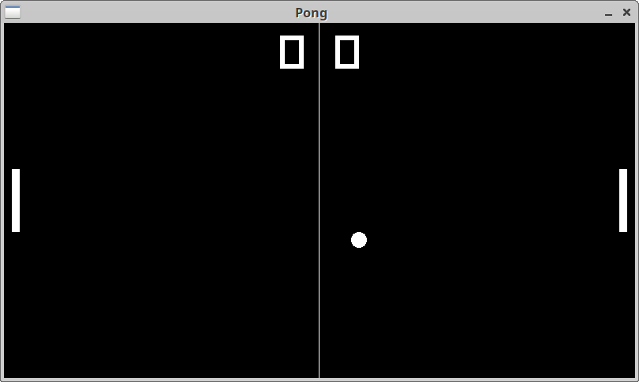

# Pong

## Description

Just a simple pong game made with [raylib](https://github.com/raysan5/raylib).

## Features

Nothing more than the base game.

## Controls

|      | Player 1 *left* | Player 2 *right* |
|------|-----------------|------------------|
| Up   | W or Z          | Up arrow         |
| Down | S               | Down arrow       |

